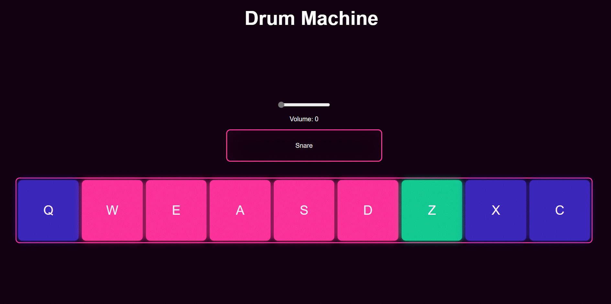

<h1 align="center">Drum Machine</h1>

Play the drums :drum: :sparkling_heart: !(Web app)

## Preview 

 


## :label: Features :100: 
- [x] Press the key from keymap will play the sound
- [x] Display the bank pads
- [x] Volume control
- [ ] Power button
- [ ] Demo Play

## :label: Tech Stack
1. ReactJS
2. Redux
3. Sass

## :label: To Run Locally
- >Make sure you've **node** installed. If not [click me](https://nodejs.org) to go to nodejs!

- >Install [yarn](https://classic.yarnpkg.com/en/) (if you don't have already)

- >Clone the repository	
	
	:heavy_check_mark: ```git clone https://github.com/subhadipghs/drum-machine.git```
	
	:heavy_check_mark: Install all the dependencies . Open terminal/cmd and run ``` yarn install ```

	:heavy_check_mark: Open terminal/cmd and run ``` yarn start ```

	:heavy_check_mark:  Open browser and go to *```localhost:3000```* :rocket:
